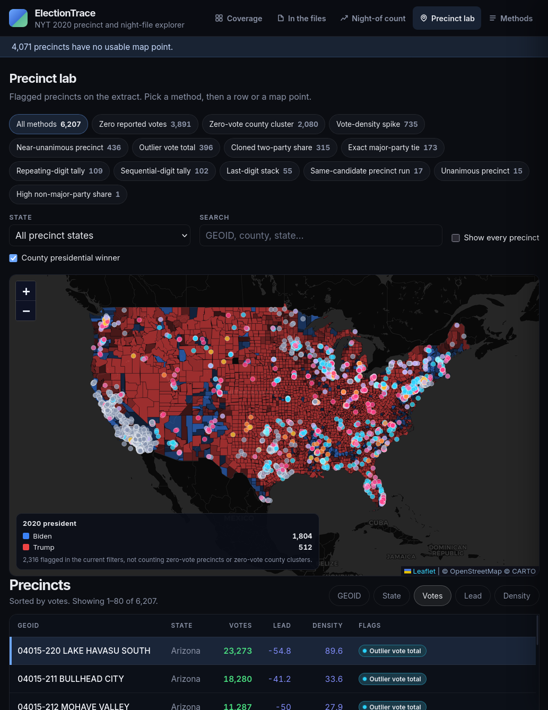
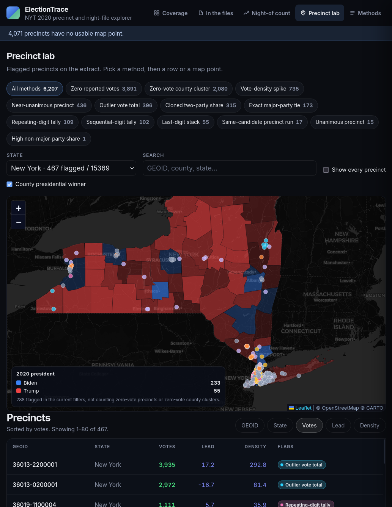
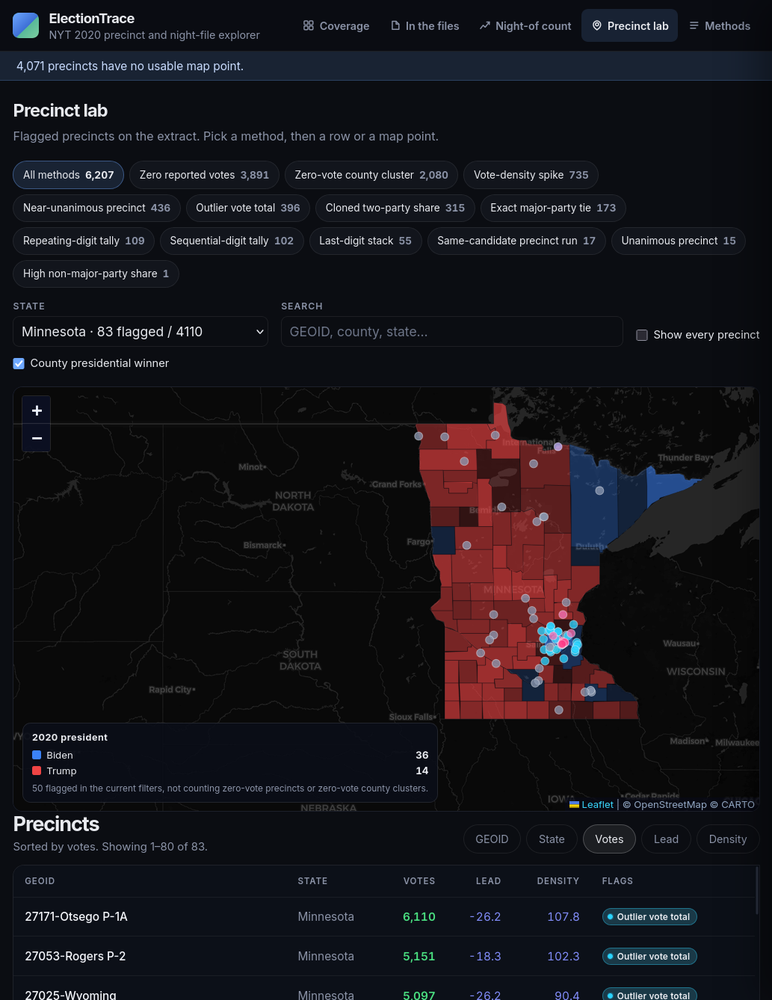
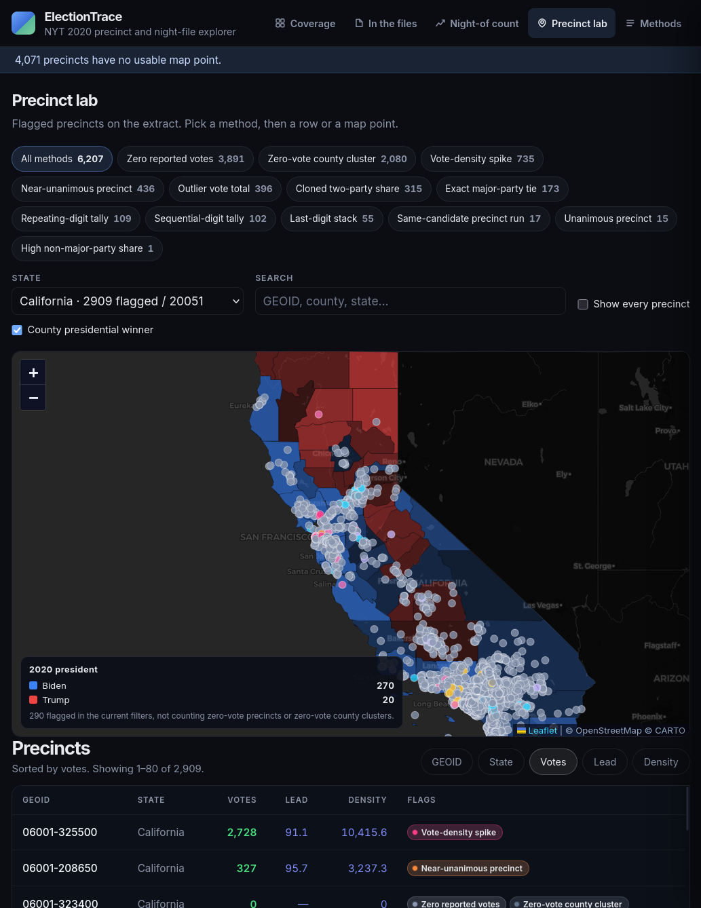
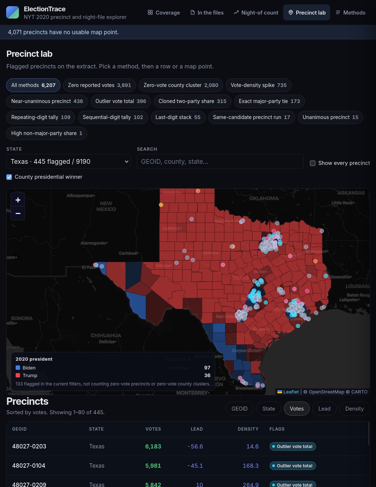
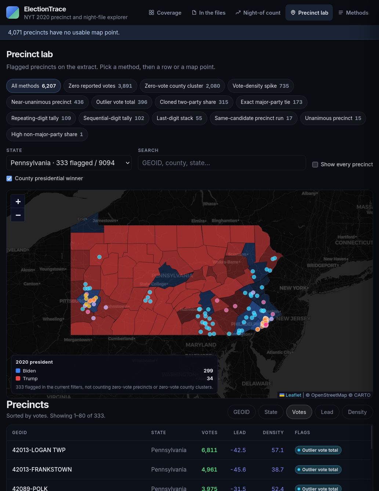
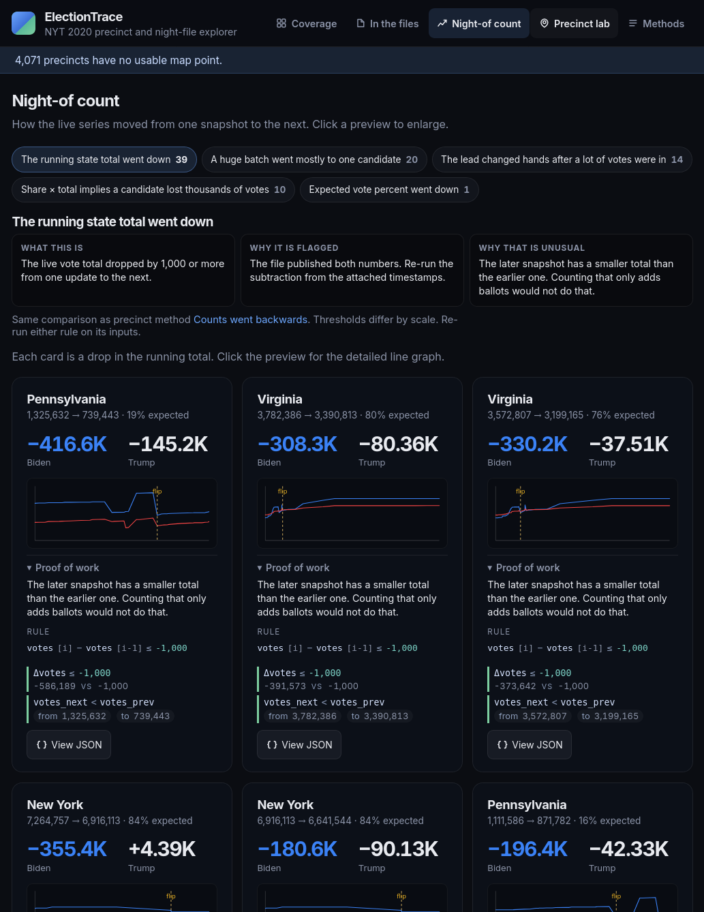
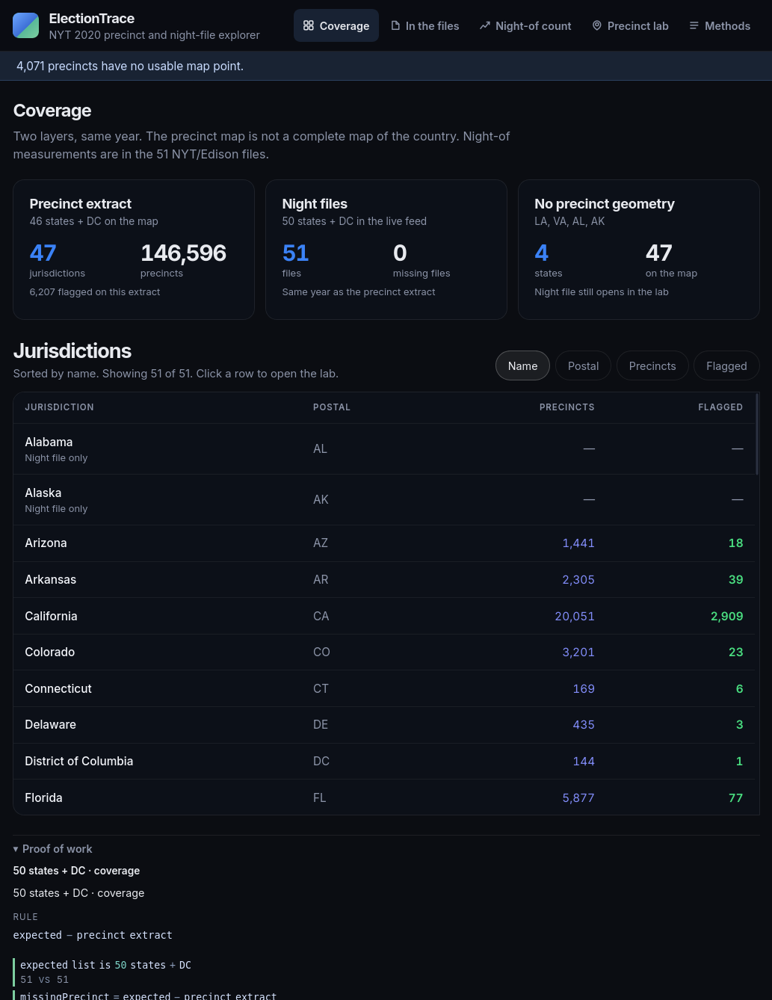

# ElectionTrace

[](https://github.com/areveur51/ElectionTrace/actions/workflows/test.yml)

National precinct-anomaly explorer for the 2020 presidential count. The same detectors run in every state. You get a map, a table, night-of charts, and a proof-of-work packet for each flag.

**Repo:** [https://github.com/areveur51/ElectionTrace](https://github.com/areveur51/ElectionTrace)

```
media/*.geojson.gz  →  index  →  map + table + night-of charts
```

## What you can do

- Browse flagged precincts on a map (county presidential winner overlay on by default)
- Filter by state, method, and search
- Open a precinct: votes first, then county night totals, then the state series
- Night-of count: retractions, implied vote-switches, lead changes, one-sided dumps
- In the files: sort order and county-vs-state totals
- Copy or download a JSON proof packet for any item

## Screenshots

Precinct lab — national map with county presidential winner overlay (on by default). Flagged counts follow the state, method, and search filters. Overlay totals skip precincts with zero reported votes. Plus / minus / net candidate votes are the two-party totals in those same flags; they change as more anomalies enter the filter.



Same lab, one state at a time. The right pane is precinct first, then county night totals, then the state series. Map hover shows flag pills.

| New York | Minnesota |
|:--:|:--:|
|  |  |

| California | Texas |
|:--:|:--:|
|  |  |



Night-of — one pattern at a time, compact state cards, enlarge a chart for the same facts and the anomaly line. **Implied votes moved between candidates** is the flat (or near-flat) share×total swap; a small total drop can still land there if the leftover is within 1,000 of that band.



Coverage — which night files are present for the selected state (precincts, counties, states, timeseries).



## Quick start

Needs [Node.js 20+](https://nodejs.org/).

```bash
git clone https://github.com/areveur51/ElectionTrace.git
cd ElectionTrace
npm install
npm start
```

Open [http://127.0.0.1:5200](http://127.0.0.1:5200).

With no extra files, the committed **sample** (a few precincts in Pennsylvania) is enough to click through the UI.

```bash
npm test          # detectors + UI contracts
npm run index     # rebuild the index without serving
```

### Docker

```bash
docker compose up --build
```

Same URL. Sample data is used until you add a full extract under `media/`.

## Full 2020 extract

The lab precinct file is ~264 MB and is **not** in git. Pull the published pack (national precincts + 51 night-of state files) from the [`data-2020`](https://github.com/areveur51/ElectionTrace/releases/tag/data-2020) release:

```bash
./scripts/fetch-data.sh
npm start
```

That unpacks `electiontrace-data.tar.gz` into `media/`. Details: [`docs/DATA.md`](docs/DATA.md).

Or copy your own `*.geojson.gz` into `media/` and optional night files into `media/nyt-election-data/`.

**Direct download (GeoJSON, gzipped):** [https://int.nyt.com/newsgraphics/elections/map-data/2020/national/precincts-with-results.geojson.gz](https://int.nyt.com/newsgraphics/elections/map-data/2020/national/precincts-with-results.geojson.gz)

Save that file under `media/` (about 264 MB), then `npm start` to index it. The extract is third-party — see [`docs/DATA.md`](docs/DATA.md).

## What it flags

Every rule is listed in the app under **Methods** and in `app/lib/methods.mjs`. Density and size tails are computed **inside each state**, then the same cutoffs apply everywhere.

Over-time rules (`vote_transfer`, `count_retraction`, `one_sided_increment`) stay quiet unless the Feature has `votes_*_prev` or a `history` array.

Night-of runs the same comparisons on the state feed. A matched implied swap is `feed_vote_switch` (Methods: **Votes moved between candidates** lists those states). A one-sided implied loss stays `implied_negative_candidate`.

The SHA-256 on **View JSON** is a checksum of that detector packet. How to re-run it: [`docs/REPRODUCE.md`](docs/REPRODUCE.md).

## HTTP API

| | |
|--|--|
| `GET /api/health` | `{ ok, ready, indexing, precincts, flagged }` |
| `GET /api/summary` | National counts, per-state tallies, Benford |
| `GET /api/methods` | Detector definitions |
| `GET /api/anomalies?state=06&type=density_spike&q=` | Paged rows |
| `GET /api/anomalies.geojson?...` | Point GeoJSON for the map |
| `GET /api/precincts/:geoid` | One precinct |
| `GET /api/precincts/:geoid/workup` | Proof-of-work packet |
| `GET /api/race?state=42&county=42001` | Night-file race + county |
| `GET /api/county-winners` | County presidential winners |
| `GET /api/anomalies-by-winner?...` | Overlay tally: flagged counts by county winner, plus / minus / net candidate votes |

## Configuration

Copy `.env.example` to `.env` only if you need to change defaults. **Do not commit `.env`.**

| Variable | Default | Purpose |
|--|--|--|
| `PORT` | `5200` | Listen port |
| `HOST` | `0.0.0.0` | Bind address |
| `MEDIA_DIR` | `./media` (or `./media/sample`) | Precinct GeoJSON |
| `DATA_DIR` | `./data` | Generated index |
| `NYT_STATES_DIR` | `./media/nyt-election-data` | Night files |
| `DATABASE_URL` | unset | Optional Postgres |
| `HTTPS_KEY` / `HTTPS_CERT` | unset | Optional TLS |

JSONL under `data/` is the default store. Postgres is optional.

## Layout

```
app/lib/methods.mjs   detectors
app/lib/scan.mjs      streams geojson.gz
app/lib/index.mjs     builds data/precincts.jsonl
app/server.mjs        API + static UI
app/public/           map + table
media/sample/         tiny demo (committed)
media/                your extract (not committed)
data/                 generated index (not committed)
docs/DATA.md          how to publish / fetch a data pack
docs/REPRODUCE.md     how to re-check a proof SHA
docs/screenshots/     README captures
```

## License

MIT. Third-party election extracts are **not** covered by that license — see [`docs/DATA.md`](docs/DATA.md).
